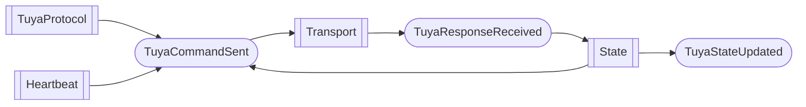

# Tuya protocol

The protocol is responsible for handling communication details with the Tuya device.
Its interface consists of an asynchronous method to update the device and accepts a callback to subscribe to state changes.

## Features
- automatic reconnection: commands will be queued until the connection is ready
- periodic heartbeat are sent to the device to keep the connection alive
- periodic refresh of the state (device will also send updates)
- internally, bricks are decoupled and communicate through events

## Event flow

